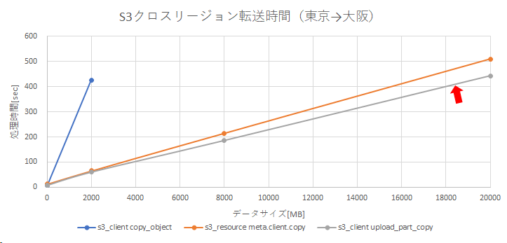

# s3-copy-with-mm
Amazon S3 file copy with multi-thread &amp; multipart sample.

# Amazon S3 cross region copy performance

以下方式のS3クロスリージョン転送時間（東京→大阪）を計測しました。

* boto3.client('s3').copy_object()
* boto3.resource('s3').meta.client.copy()
* boto3.client('s3').upload_part_copy() <- This Sample Code

その結果、本サンプルが最も速くデータを転送できました。（下図）



# Total Result

データ転送だけでなくタグやメタデータのCopyも含めた方式の比較結果は下表のとおりです。

| 方式 | タグ | メタデータ | 速度 | 上限サイズ | 備考 |
| :--- | :---: | :---: | :---: | :---: | :--- |
| boto3.client('s3').copy_object() | O<br />Copyされる | O<br />Copyされる | X<br />遅い | X<br />5GB | 最も低速だがタグやメタデータが一緒にCopyされる |
| boto3.resource('s3').meta.client.copy() | X<br />Copyされない | X<br />Copyされない | O<br />速い | O<br />5TB | 高速だがタグやメタデータが基本的にCopyされない |
| boto3.client('s3').upload_part_copy() | O<br />Copyされる | O<br />Copyされる | O<br />速い | O<br />5TB | 最も高速でタグやメタデータもCopyできる |

以上の結果から、ファイルサイズが大きく、タグやメタデータも含め高速にCopyする場合は、本サンプルの方式が最も優れていました。

# Appendix.

## How to make big test data file for Windows

```
fsutil file createnew bigfile_001mb 1048576
fsutil file createnew bigfile_010mb 10485760
fsutil file createnew bigfile_100mb 104857600
fsutil file createnew bigfile_500mb 524288000
fsutil file createnew bigfile_01gb 1073741824
fsutil file createnew bigfile_02gb 2147483648
fsutil file createnew bigfile_05gb 5368709120
fsutil file createnew bigfile_08gb 8589934592
fsutil file createnew bigfile_10gb 10737418240
fsutil file createnew bigfile_20gb 21474836480
```
